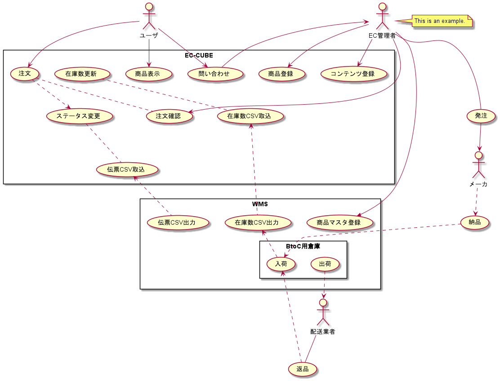

# システム概要

## システム
### サーバ 
* EC-CUBE 4.1  
* PostgreSQL 10.5  
* Apache 2.4  
### クライアント
* PCブラウザ Google Chromes最新版  
* Andoridブラウザ Google Chromes最新版  
* iPhone/iPadブラウザ safari最新版  
!!! note
開発開始時点での最新版です。  
開発中またはローンチ後にブラウザの仕様の変更が入った場合は、別途協議の上対応します。

## ユースケース図

